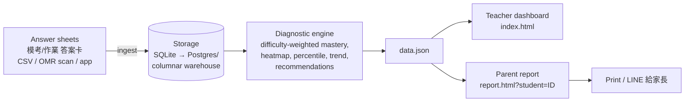

# Architecture

## End-to-end flow

## Why these choices

- **Ingestion.** Schools already produce answer data weekly; we accept the lowest-friction
  format (CSV export / 答案卡 OMR / app capture). No content lock-in — we analyse the
  school's *own* exams, unlike walled platforms (PaGamO, 因材網).
- **Storage.** SQLite for the demo; the schema (`students`, `items`, `responses`) and the
  GROUP-BY aggregations are warehouse-agnostic. At scale, `responses` is the only large,
  append-only table.
- **Processing.** Difficulty-weighted (IRT-style) mastery recovers true weak topics. All
  metrics are simple SQL aggregations + light Python — cheap and explainable, which matters
  for trust with teachers and parents.
- **Delivery.** Static artifacts that read `data.json`; trivially deployable and printable.

## Scale story (10× / 100×)

| Dimension | Demo (1 school) | 100× (≈100 branches) |
|-----------|-----------------|----------------------|
| Students  | 75 | ~25,000 |
| Responses / term | 9,000 | ~30M, append-only |
| Storage | SQLite file | Postgres + object store for raw scans; partition `responses` by `(school, term)` |
| Processing | single process | batch job per exam (the unit of work is one exam upload) — embarrassingly parallel by school |
| Delivery | static files | per-school static bundles behind auth; reports pre-rendered on exam upload |

The workload is **bursty and batch-shaped** (each mock exam triggers one diagnostic
run), so it parallelises cleanly per school/exam and does not need always-on streaming.
